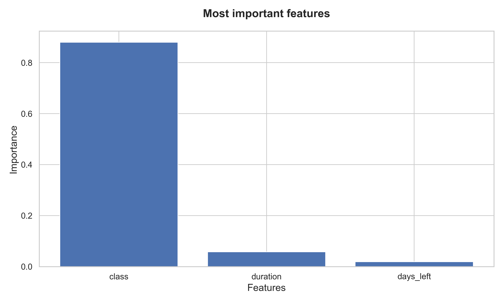

# ML-model for flight price prediction: Project overview

## Summary
This project examines Flight Price Prediction data set to understand what affects the fligth prices and create a ML-model for predicting the price of a flight.
The project covered the following:
* Exploratory data analysis to understand the data set
* Creation of a Random Forest ML-model that can be used to predict the price of a flight
* Evaluation of which features affect the price most

The main conclusions are:
- The Random Forest machine learning model achieved an R² score of 0.985, indicating a strong predictive performance.
- The most influential features affecting ticket prices are:
  1. Class of the flight (economy or business)
  2. Duration of the flight
  3. Number of days remaining until departure

     
## Code and resources used
**Python Version:** 3.11.5  
**Packages:** Numpy, Pandas, Seaborn, Matplotlib, Math, Scikit-learn

## Data
The analysis has been conducted using the data set FLight Price Prediction. It is available on Kaggle at this link: [Flight Price Prediction](https://www.kaggle.com/datasets/jainaru/world-happiness-report-2024-yearly-updated)

The columns of the dataset are listed below. More information about each column are available on the link above: 
* Airline Company
* Flight Code
* Source City
* Departure Time
* Number of stops
* Arrival Time
* Destination City
* Ticket Class
* Flight Duration

## Exploratory Data Analysis
Below are some selected highlights from the exploratory data analysis

  

  

  

  
## Data Cleaning and preprocessing
* Droped unnamed column
* Preprocesed data frame by turning all columns into numerical values

## Random Forest Model
* Implemented random forest model
* Evaluated the model
* Compared model predictions to actual flight prices (See image below)
* Identifed the featuers with the highest affect on ticket price (See image below)

    
